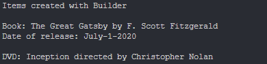
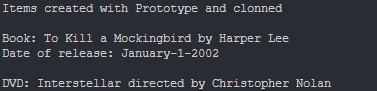

# Topic: *Creational Design Patterns*
## Author: *Cojuhari Milena*
------
## Objectives:
&ensp; &ensp; 1. Study and understand the Creational Design Patterns.

&ensp; &ensp; 2. Choose a domain, define its main classes/models/entities and choose the appropriate instantiation mechanisms.

&ensp; &ensp; 3. Use some creational design patterns for object instantiation in a sample project.


## Used Patterns: 

* Singleton
* Builder
* Prototype
* Factory Method


## Implementation

* My project is the implementation of a sample Library Management System. Its main functionalities represents library operations, item and member management, as register book, borrow/return book. 

* __Singleton__ -  The Singleton pattern ensures that only one instance of a class is created and provides a global point of access to that instance.
    * *LibraryItemRepository* class: has a private constructor and a static method (*getInstance()*) that returns the single instance of the repository.
```cpp
LibraryItemRepository& LibraryItemRepository::getInstance() 
{
    if (instance == nullptr) {
        instance = new LibraryItemRepository();
    }
    return *instance;
};
```
* __Builder__ -  The Builder pattern separates the construction of a complex object from its representation.
    * *ILibraryItemBuilder* interface: defines the steps for building a library item, and concrete builders (*BookBuilder* and *DVDBuilder*) implement those steps. 
    * *LibraryItemDirector* orchestrates the construction process using the builders.
```cpp
class ILibraryItemBuilder 
{
public:
    virtual void buildTitle(const std::string& title) = 0;
    virtual void buildCreator(const std::string& creator) = 0;
    virtual void buildDate(const std::string& dateOfRelease) = 0;
    virtual ILibraryItem* getResult() = 0;
};
```
```cpp

ILibraryItem* LibraryItemDirector::constructBook(ILibraryItemBuilder& builder, const std::string& title, const std::string& author, const std::string &dateOfRelease) 
{
    builder.buildTitle(title);
    builder.buildCreator(author);
    builder.buildDate(dateOfRelease);
    return builder.getResult();
}
```

* __Prototype__ -  The Prototype pattern allows to create new objects by copying an existing object, known as a prototype.
    * *ILibraryItemPrototype* interface: defines the clone() method.
    * *Book* and *DVD* classes:  implement it to create copies of themselves.
```cpp
class ILibraryItemPrototype {
public:
    virtual ILibraryItemPrototype* clone() const = 0;
    virtual void displayInfo() const = 0;
    virtual ~ILibraryItemPrototype() {}
};
```
```cpp
ILibraryItemPrototype* Book::clone() const 
{
    return new Book(*this);
}
```

* __Factory__ -  The Factory pattern provides an interface for creating objects but allows subclasses to alter the type of objects that will be created.
    * *LibraryItemFactory* class: defines static methods (*createBook* and *createDVD*) for creating instances of library items (books and DVDs). 
```cpp
ILibraryItem* LibraryItemFactory::createBook(const std::string& title, const std::string& author, const std::string &dateOfRelease) 
{
    return new Book(title, author, dateOfRelease);
}

ILibraryItem* LibraryItemFactory::createDVD(const std::string& title, const std::string& director, const std::string &dateOfRelease) 
{
    return new DVD(title, director, dateOfRelease);
}
```

## Results
* __Singleton__ - I tested the pattern to make sure it creates a single instance of the repository.
```cpp
 // Use Singleton to create the ItemRepository;
LibraryItemRepository& repo1 = LibraryItemRepository::getInstance();
LibraryItemRepository& repo2 = LibraryItemRepository::getInstance();

if (&repo1 == &repo2) {
    std::cout << "Only one instance of LibraryItemRepository is created." << std::endl;
} else {
    std::cout << "Multiple instances of LibraryItemRepository were created (not expected)." << std::endl;
    }
```
Output:


* __Builder__ - I used the builder pattern to create a book and DVD item inside my library.
```cpp
// Use the LibraryItemBuilder to create books and DVDs
LibraryItemDirector director;
BookBuilder bookBuilder;
DVDBuilder dvdBuilder;

ILibraryItem* book1 = director.constructBook(bookBuilder, "The Great Gatsby", "F. Scott Fitzgerald", "July-1-2020");
ILibraryItem* dvd1 = director.constructDVD(dvdBuilder, "Inception", "Christopher Nolan", "December-7-2010");
```
Output:


* __Prototype__ - I created a book and DVD item with the prototype pattern, and then I cloned them to create new instances.
```cpp
// Create book and dvd prototype
ILibraryItemPrototype* bookPrototype = new Book("To Kill a Mockingbird", "Harper Lee", "January-1-2002");
ILibraryItemPrototype* dvdPrototype = new DVD("Interstellar", "Christopher Nolan", "October-13-2015");

// Clone prototypes to create new instances
ILibraryItem* bookClone = dynamic_cast<ILibraryItem*>(bookPrototype->clone());
ILibraryItem* dvdClone = dynamic_cast<ILibraryItem*>(dvdPrototype->clone());
```
Output:


* __Factory__ - I created books and DVDs using the factory pattern. 
```cpp
// Use the LibraryItemFactory to create books and DVDs
ILibraryItem* book2 = LibraryItemFactory::createBook("Pride and Prejudice", "Jane Austen", "December-31-2002");
ILibraryItem* dvd2 = LibraryItemFactory::createDVD("The Matrix", "Wachowskis", "September-21-1999");
```
Output:


## Conclusions
&ensp; &ensp; In conclusion, during this laboratory work I successfully implemented several creational design patterns: Singleton, Builder, Prototype and Factory.

&ensp; &ensp; In conclusion, these patterns enhance code maintainability, reusability, and scalability. By using them, the library management system becomes more adaptable to future changes and requirements.