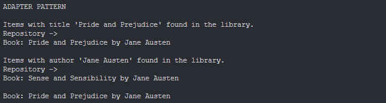
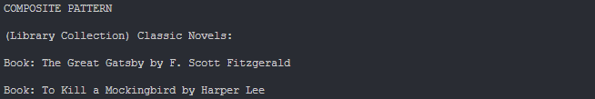
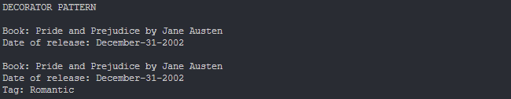
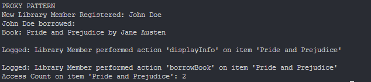

# Topic: *Structural Design Patterns*
## Author: *Cojuhari Milena*
------
## Objectives:

&ensp; &ensp; 1. Study and understand the Structural Design Patterns.

&ensp; &ensp; 2. As a continuation of the previous laboratory work, think about the functionalities that your system will need to provide to the user.

&ensp; &ensp; 3. Implement some additional functionalities, or create a new project using structural design patterns.

## Used Patterns: 

* Adapter
* Composite
* Decorator
* Proxy

## Implementation

* My project is the implementation of a sample Library Management System. Its main functionalities represents library operations, item and member management, as register book, borrow/return book. 

* __Adapter__ -  The Adapter pattern is used to make two incompatible interfaces work together.
    * *IExternalCatalog* interface: is adapted to the *ILibraryItemRepository* interface. This allows the external catalog to search for library items using the repository's methods, making the two interfaces compatible.
    * *CatalogAdapter* class: is an adapter class that bridges the gap between the *IExternalCatalog* interface and the *ILibraryItemRepository*.
```cpp
class CatalogAdapter : public IExternalCatalog 
{
private:
    ILibraryItemRepository& repository;

public:
    CatalogAdapter(ILibraryItemRepository& repository);

    void searchBooksByTitle(const std::string& title) override;
    void searchBooksByAuthor(const std::string& author) override;
};
```

* __Composite__ -  The Composite pattern is used to create hierarchical structures of objects, treating individual objects and compositions of objects uniformly.
    * *ILibraryComponent* interface: defines a common interface for both leaf nodes and composite nodes.
    * *LibraryCollection* class: maintains a list of child components.
```cpp
class ILibraryComponent 
{
public:
    virtual void displayInfo() const = 0;
    virtual std::string getTitle() const = 0;
};
```
```cpp
class LibraryCollection : public ILibraryComponent, public ILibraryCollection 
{
private:
    std::string name;
    std::vector<ILibraryComponent*> children;

public:
    LibraryCollection(const std::string& name);
    void displayInfo() const override;
    std::string getTitle() const override;
    void addLibraryComponent(ILibraryComponent* component);
    ~LibraryCollection();
};
```

* __Decorator__ -  The Decorator pattern is used to add responsibilities or behavior to objects dynamically without affecting the behavior of other objects from the same class.
    * *TaggedLibraryItem* class: modifies the behavior of library items by adding tags dynamically. 
```cpp
class TaggedLibraryItem : public ILibraryDecorator 
{
private:
    ILibraryItem* item;
    std::string tag;

public:
    TaggedLibraryItem(ILibraryItem* item, const std::string& tag);
    void displayInfo() const override;
    void displayFullInfo() const override;
    std::string getTitle() const override;
    std::string getAuthor() const override;
};
```

* __Proxy__ -  The Proxy pattern is used to provide a surrogate or placeholder for another object to control access to it.
    * *LibraryProxy* class: defines tracks access counts, logs interactions, and controls access to the underlying ILibraryItem.
```cpp
ILibraryItem* LibraryItemFactory::createBook(const std::string& title, const std::string& author, const std::string &dateOfRelease) 
{
    return new Book(title, author, dateOfRelease);
}

ILibraryItem* LibraryItemFactory::createDVD(const std::string& title, const std::string& director, const std::string &dateOfRelease) 
{
    return new DVD(title, director, dateOfRelease);
}
```

## Results
* __Adapter__ - The External Catalog was adapted to the LibraryRepository, and now, through it we can find books in the library.
```cpp
CatalogAdapter catalogAdapter(repo);
catalogAdapter.searchBooksByTitle("Pride and Prejudice");
catalogAdapter.searchBooksByAuthor("Jane Austen");
```
Output:


* __Composite__ - It creates a separate collections of books and stores them together.
```cpp
LibraryCollection* collection = new LibraryCollection("Classic Novels");
collection->addLibraryComponent(book2);
collection->addLibraryComponent(book3);

collection->displayInfo();
```
Output:


* __Decorator__ - It adds the tag element to LibraryItems. We can see the books info before adding the tag and after.
```cpp
ILibraryDecorator* taggedBook = new TaggedLibraryItem(book, "Romantic");

book->displayFullInfo();
taggedBook->displayFullInfo();
```
Output:


* __Proxy__ - It counts the acces to LibraryItems and loggs the information when they are accessed. 
```cpp
LibraryMember member("John Doe");
LibraryProxy itemProxy(book);

member.borrowItem(&itemProxy);
itemProxy.markAsBorrowed();

itemProxy.getAccessCount();
```
Output:


## Conclusions
&ensp; &ensp; In conclusion, during this laboratory work I successfully implemented several structural design patterns: Adapter, Composite, Decorator and Proxy.

&ensp; &ensp; By incorporating these design patterns, my library management system becomes more flexible, maintainable, and extensible. They allowe me to adapt to future requirements and changes in a structured and organized manner.