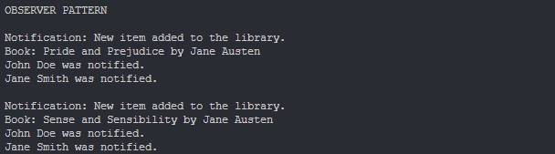
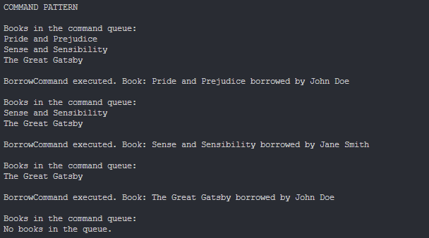
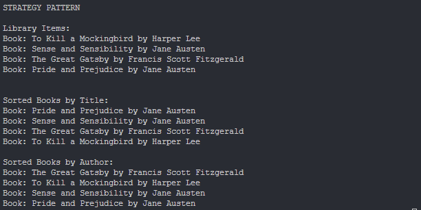

# Topic: *Behavioral Design Patterns*
## Author: *Cojuhari Milena*
------
## Objectives:

&ensp; &ensp; 1. Study and understand the Behavioral Design Patterns.

&ensp; &ensp; 2. As a continuation of the previous laboratory work, think about what communication between software entities might be involed in your system.

&ensp; &ensp; 3. Create a new Project or add some additional functionalities using behavioral design patterns.

## Used Patterns: 

* Observer
* Command
* Strategy

## Implementation

* My project is the implementation of a sample Library Management System. Its main functionalities represents library operations, item and member management, as register book, borrow/return book. 

* __Observer__ -  Allows a subject to notify its observers of state changes, typically by calling one of their methods.
    * *ILibraryObserver* interface: is the observer interface.
    * *LibraryMember* class: implement the observer interface.
    * *Library* class: maintains a list of observers and notifies them when changes occur.
```cpp
class ILibraryObserver 
{
public:
    virtual void update() = 0;
};
```
```cpp
void Library::attachObserver(ILibraryObserver* observer) 
{
    observers.push_back(observer);
}

void Library::notifyObservers() 
{
    for (auto observer : observers) 
    {
        observer->update();
    }
}
```
```cpp
void LibraryMember::update() 
{
    std::cout << name << " was notified." << std::endl;
}
```

* __Command__ -  Encapsulates a request as an object, thereby allowing parameterization of clients with different requests, queuing of requests, and logging of the parameters of a request.
    * *ILibraryCommand* interface:  is the command interface.
    * *BorrowCommand* class: is a concrete command class that encapsulates the borrowing action.
    * *CommandQueue* class: manages a queue of commands and executes them in sequence.
    * *Library* class: enqueues BorrowCommand objects in the command queue.
```cpp
class BorrowCommand : public ILibraryCommand 
{
private:
    ILibraryItem* item;
    ILibraryMember* member;

public:
    BorrowCommand(ILibraryItem* item, ILibraryMember* member);
    void execute() override;
    std::string getBorrowedItemTitle() const;
};
```
```cpp
void CommandQueue::addCommand(ILibraryCommand* command) 
{
    commands.push_back(command);
}

void CommandQueue::executeCommands() 
{
    printBooksInQueue();
    while (!commands.empty()) {
        ILibraryCommand* command = commands.front();
        command->execute();
        delete command;
        commands.pop_front();

        printBooksInQueue();
    }
}
```

* __Strategy__ - Defines a family of algorithms, encapsulates each algorithm, and makes them interchangeable. 
    * *IStrategy* interface: is the strategy interface.
    * *SortByAuthor* and *SortByTitle* classes: are concrete strategy classes that define different sorting algorithms.
    * *Library* class: uses a sorting strategy to display library items in a sorted order.
```cpp
void SortByTitle::sort(std::vector<ILibraryItem*>& items) const {
    std::sort(items.begin(), items.end(),
              [](const ILibraryItem* a, const ILibraryItem* b) {
                  return a->getTitle() < b->getTitle();
              });
}
```
```cpp
void Library::displaySortedBooks(IStrategy* sortingStrategy) const {
    std::vector<ILibraryItem*> items = itemRepository.getAllLibraryItems();

    if (sortingStrategy) {
        itemRepository.setSortingStrategy(sortingStrategy);
        itemRepository.sortItems(items);
    }

    std::cout << "\nSorted Books by " << sortingStrategy->getStrategyName() << ":" << std::endl;
    for (const auto& item : items) {
        item->displayInfo();
    }
}
```

## Results
* __Observer__ - The library members are the observers and they are being notified when a new book is added to the library.
```cpp
LibraryMember member1("John Doe");
LibraryMember member2("Jane Smith");

ILibraryItem* book = new Book("Pride and Prejudice", "Jane Austen", "December-31-2002");
ILibraryItem* book1 = new Book("Sense and Sensibility", "Jane Austen", "April-29-2003");
```
Output:


* __Command__ - When members want to borrow a book a command is created and sent into a queue. Aftere the CommandQueue is executed, all commands inside the queue are processed in a FIFO order.
```cpp
myLibrary.enqueueCommand(new BorrowCommand(book, &member1));
myLibrary.enqueueCommand(new BorrowCommand(book1, &member2));
myLibrary.enqueueCommand(new BorrowCommand(book2, &member1));

myLibrary.processCommandQueue();
```
Output:


* __Strategy__ - All library items are sorted by the sorthing method selected.
```cpp
myLibrary.displayLibraryItems();

myLibrary.displaySortedBooks(new SortByTitle());
myLibrary.displaySortedBooks(new SortByAuthor());
```
Output:


## Conclusions
&ensp; &ensp; In conclusion, during this laboratory work I successfully implemented several behavioral design patterns: Observer, Command and Strategy.

&ensp; &ensp; The use of the Observer pattern enables efficient notification of library changes to members, while the Command pattern encapsulates actions like borrowing in a flexible and queue-based structure. The Strategy pattern enhances the system's versatility by allowing the dynamic selection of sorting algorithms for displaying library items.

&ensp; &ensp; By incorporating these design patterns, my library management system becomes more flexible, maintainable, and extensible.